# Introduction to ROS 2 - environment structure and basic concepts

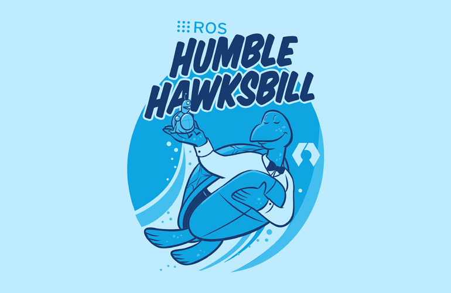

## Robot Operating System

The Robot Operating System (ROS) is a set of development libraries and tools for building robotic applications. ROS offers open-source tools ranging from sensor and robot controllers to advanced algorithms. Since late 2017, there has been the first distribution of ROS 2, _Ardent Apalone_, which significantly extends the functionality of ROS 1. The latest stable version, [Humble Hawksbill](https://docs.ros.org/en/rolling/Releases.html), is currently being used within the lab. Despite this change, the key [concepts](https://docs.ros.org/en/humble/Concepts.html#graph-concepts) remain the same:

🐢 processing based on independent modules ([graph concept](https://docs.ros.org/en/humble/Concepts.html#graph-concepts) - nodes. _nodes_),

🐢 communication through publishing and subscribing ([concept of _publisher/subscriber_),

🐢 communication with feedback through services or actions (_services_, _actions_),

🐢 language-neutrality (any programming language can be integrated, _ROS client library_, _actions_). [_ROS client library_](https://docs.ros.org/en/humble/Concepts.html#client-libraries).

Dedicated for advanced research projects, ROS 1 could not be utilized for industrial applications. It was limited by weaknesses related to message access security and the lack of adaptation to the requirements of real-time systems. The second generation, ROS 2, was redesigned to meet these challenges. The differences between the versions are described in [article](http://design.ros2.org/articles/changes.html).

## Basic concepts

### Environment (_workspace_)

A ROS environment is the place where packages are stored, e.g. for a particular robot. There can be many different environments on one computer (e.g. _ros2_robotA_ws_, _ros2_robotB_ws_). 

Example environment structure:

```text
ros2_ws
├── build - contains files for the build process, so that only new changes can be included in the re-build
├─ install - place where packages are installed
├── log - contains the log of the build process
└─── src - developer's ROS workspace containing packages
```

Building the ROS 2 environment is done using [`colcon`](https://colcon.readthedocs.io/en/released/), with the following command:

```bash
colcon build
```

It is possible to build a single package:

```bash
colcon build --packages-select package_name
```

The first step before working with the built ROS environment is to set the environment variables (_source_), so we can access the packages in a particular terminal.

In the `~/ros2_ws` directory, call the command:

```bash
source install/setup.bash
```

**Every time you open a terminal window and intend to work in a particular environment, call the above command in the appropriate directory.**

It should be called in the root directory of the ROS 2 environment (e.g. `~/ros2_ws`).

### Packet

A parcel is the place where nodes are stored. It is used to organise code so that the software is modular.

Example of a package structure (Python):

```text
my_package/
      my_package - directory containing the nodes
      setup.py - contains instructions for installing the package
      setup.cfg - holds information about the executable files
      package.xml - contains information about the package and its dependencies
      resource/my_package - directory required to locate the package
      test - contains scripts for automatic testing
```

The organisation of packages is done by using [`ament`](http://design.ros2.org/articles/ament.html), an evolution of [`catkin`](https://www.google.com/url?sa=t&rct=j&q=&esrc=s&source=web&cd=&ved=2ahUKEwi3t9bii7b7AhWSw4sKHXGFCvoQFnoECBQQAQ&url=http%3A%2F%2Fwiki.ros.org%2Fcatkin&usg=AOvVaw0vs2wEMzUY0BPSzVhnvG6P) known from ROS 1. With this tool, packages are structured.

Creating a package (C++):

```bash
ros2 pkg create --build-type ament_cmake package_name
```

Creating a package (Python):

```bash
ros2 pkg create --build-type ament_python package_name
```

It is possible to indicate dependencies with the `--dependencies` argument and to create a node at the same time via the additional `--node-name` argument.

#### Package Dependencies Management

A tool that significantly improves the work of the ROS developer is [`rosdep`](https://docs.ros.org/en/foxy/Tutorials/Intermediate/Rosdep.html). It allows the automatic installation of dependencies (packages, libraries) of all packages in a given environment. Thanks to the fact that the dependencies are defined in the `package.xml` file, there is no need to install them manually.

Many ready-made packages are located in the ROS repository - `rosdistro`, each user has the possibility to add his package to it via _pull request_. Information on how to add a package that is not yet listed is [here](rosdistro).

To use `rosdep` call the following commands inside the `~/ros2_ws` directory:

```bash
sudo rosdep init
rosdep update
rosdep install --from-paths src -y --ignore-src --rosdistro humble
```

These commands initialise `rosdep` and then update the local indexes from the `rosdistro` package database. The last command installs the dependencies. The `--from-paths src` argument tells you to look for `package.xml` files inside the `src` directory, `-y` causes console messages to be automatically accepted, and `--ignore-src` omits packages located in the `src` directory from the installation (since they will be built by us).

### Node

A node represents a single process in ROS. Nodes can publish or subscribe to topics, share or use services and actions.

Starting nodes is done via the command:

```bash
ros2 run package_name node_name
```

To get the current list of nodes:

```bash
ros2 node list
```

To obtain node information:

```bash
ros2 node info <node_name>
```

### Graph concept ([`ROS 2 graph`](https://docs.ros.org/en/foxy/Tutorials/Beginner-CLI-Tools/Understanding-ROS2-Nodes/Understanding-ROS2-Nodes.html#id2))

A ROS graph (_ROS graph_) is a network of nodes that process data. It includes all nodes and the communication links between them. A ROS graph contains:

🐢 nodes - processes that exchange messages

🐢 messages - types of data exchanged

🐢 topics - communication channel between nodes

🐢 discovery - automatic process of establishing a connection between nodes

 The tool that allows you to view and visualize the current state of the graph is:

```bash
rqt_graph
```

Example graph visualisation:
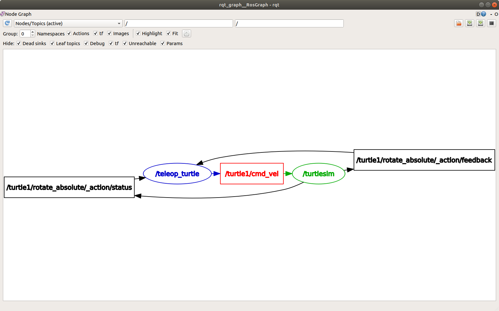

It is possible to group nodes allowing them to be run collectively. The `launch` files are used for this. Invoking an existing `launch` file is done by the command:

```bash
ros2 launch package_name launch_name
```

In ROS 2, `launch` files can take one of three extensions, `.xml`, `.py` or `.yaml`. The `.py` extension is recommended due to the flexibility of this language. For more information, see the file reference [`launch`](https://docs.ros.org/en/humble/How-To-Guides/Launch-file-different-formats.html).

### Theme

A topic is a unique name by which nodes can establish connections and communicate. A topic is created when a node starts publishing a specific type of message.


A single node can publish messages on multiple topics and subscribe to messages from multiple topics.


Viewing the current list of topics is done using the command:

```bash
ros2 topic list
```

List of topics with their associated message types:

```bash
ros2 topic list -t
```

Reading messages from the topic:

```bash
ros2 topic echo topic_name
```

A single topic can have multiple publishers as well as subscribers. Information about them, as well as the type of message being exchanged, can be checked with the command:

```bash
ros2 topic info topic_name
```

It is also possible to publish messages on a topic from the terminal:

```bash
ros2 topic pub topic_name message_type 'message_data'
```

Example:

```bash
ros2 topic pub --once /turtle1/cmd_vel geometry_msgs/msg/Twist "{linear: {x: 2.0, y: 0.0, z: 0.0}, angular: {x: 0.0, y: 0.0, z: 1.8}}"
```

To publish a message once, you can use the `--once` argument.

To read the frequency with which data is published on a topic:

```bash
ros2 topic hz topic_name
```

### Message

A message is an element of communication between nodes. It can contain different types of information (e.g. location, orientation, camera image).
Examples of default message types:

🐢 [geometry_msgs/msg/Twist](https://docs.ros2.org/latest/api/geometry_msgs/msg/Twist.html)

🐢 [sensor_msgs/msg/Image](https://docs.ros2.org/latest/api/sensor_msgs/msg/Image.html)

🐢 [std_msgs/msg/Header](https://docs.ros2.org/latest/api/std_msgs/msg/Header.html)

For message information:

```bash
ros2 interface show message_type
```

## Message visualisation

`RViz` is a graphical interface that allows you to display information from topics using built-in plugins. It allows you to look at the world through the _eyes_ of the robot or sensor. For ROS 2, `RViz` is launched with the command:

```bash
rviz2
```

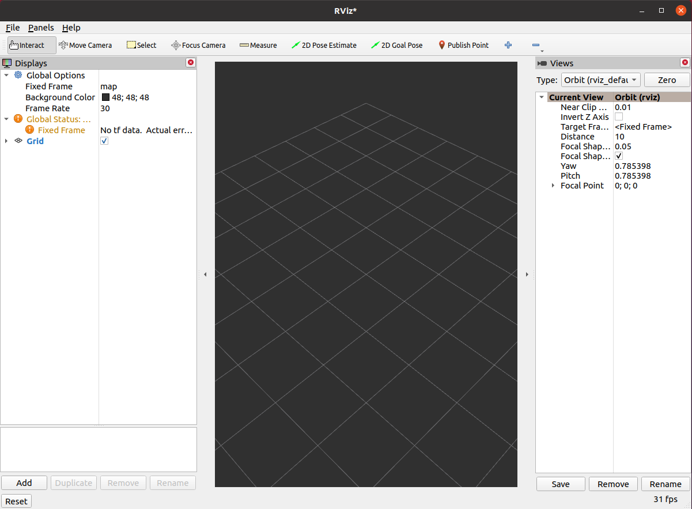

## Dynamic simulation

`Gazebo` is a simulation environment that allows you to create a working environment for your robot and simulate its interaction with objects.
`Gazebo` is launched with the command:

```bash
gazebo
```

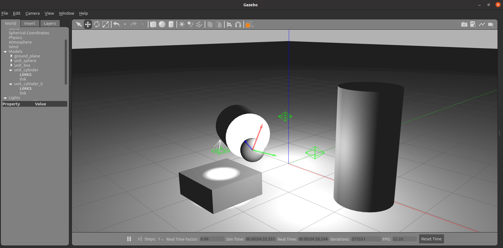

## ROS in Docker

To start with, it is a good idea to build your own extended image based on the official one using the following Dockerfile:

```Dockerfile
FROM ros:humble

RUN apt-get update && apt-get -y upgrade && apt-get -y install ros-humble-desktop
```

The build can be performed with the command:

```bash
docker build -t ros2_lab .
```

A container based on the official image can be run with the command:

```bash
xhost +local:root && docker run -it \
    --env="DISPLAY" \
    --env="QT_X11_NO_MITSHM=1" \
    --volume="/tmp/.X11-unix:/tmp/.X11-unix:rw" \
    -v ~/ros2:/root/ros2 \
    --net=host \
    --privileged \
    --name=ros2_lab \
    ros2_lab:latest
```

We will be able to reuse the container prepared in this way. In order to restart it, just call the command:

```bash
docker start -i ros2_lab
```

If we need an additional terminal running "in the container", we can open it with the command:

```bash
docker exec -it ros2_lab bash
```

## Working with ROS 2 with multiple computers on the local network

The standard used by ROS 2 for communication is DDS. In DDS there is the concept of "domains". These allow the logical separation of connections within a network.

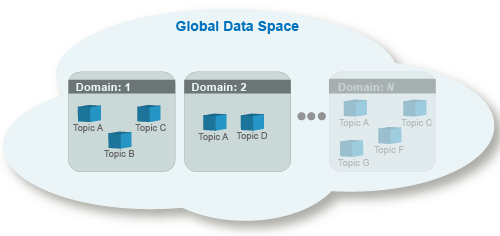

Nodes in the same domain can freely detect each other and send messages to each other, whereas nodes in different domains cannot. 
All ROS 2 nodes use domain ID 0 by default. To avoid interference between different groups of ROS 2 computers on the same network, a different domain ID should be set for each group.
Within the laboratory, it is necessary to set a separate unique domain ID for each computer. To do this, read the number from the sticker stuck to the monitor and substitute it in the following command in place of `NR_COMPUTER`. If there is no sticker on your computer, select a number between 0-101 or 215-232.
For more information, see the following link: [About domain ID](https://docs.ros.org/en/humble/Concepts/About-Domain-ID.html).

```bash
grep -q ^'export ROS_DOMAIN_ID=' ~/.bashrc || echo 'export ROS_DOMAIN_ID=NR_COMPUTER' >> ~/.bashrc
```

The above command will set the indicated domain ID in each terminal window. This will prevent nodes from being visible between different computers on the same network.

## Tasks

0. Make the domain id change to a unique one. To do this, read the number from the sticker stuck to the monitor (e.g. K006 - only the number 6 is selected) and substitute it into the following command in place of `NR_COMPUTER`. If there is no sticker on your computer, select a number between 0-101 or 215-232.

```bash
grep -q ^'export ROS_DOMAIN_ID=' ~/.bashrc || echo 'export ROS_DOMAIN_ID=NR_COMPUTER' >> ~/.bashrc
```

💡To observe the changes close the current terminal window and start a new one, or if you do not want to close the terminal window, type `source ~/.bashrc`.

1. install and run the example node. Download the [`usb_cam`](https://github.com/ros-drivers/usb_cam/tree/ros2) package and place it in the `src` directory of the ROS environment 2. 
Use the `git clone --branch ros2 https://github.com/ros-drivers/usb_cam.git` command.
2. the `usb_cam` package defines a dependency on other packages. Perform an automatic installation of the dependencies using `rosdep`.
3. build the ROS 2 environment with the `colcon build` command and make source: `source install/setup.bash`.

    Note: if you have problems with the above installation from source, there is a second option to install the package. You can do a system installation with the `sudo apt-get install ros-humble-usb-cam` command. 
    In this case, the package will not appear in the `src` directory of your local environment and you will not need to build this package. 
    To load libraries installed on the system use the command: `source /opt/ros/humble/setup.bash` instead of the local equivalent.

4. run the installed package node with the command: `ros2 run usb_cam usb_cam_node_exe`.

5. in a new terminal window (`Ctrl + Shift + T`), perform the following analysis:

    5.1 Display the list of topics.

    5.2 Display the subject information `/image_raw`.  

    5.3. Display the messages from the `/image_raw` topic.

6. start `RViz` with the `rviz2` command and display the camera image. To do this, locate the "Add" button -> "By topic" -> `/image_raw` -> `Image`.

7. display the image using the `image_view` node, install if necessary.

    ```bash
    sudo apt-get install ros-humble-image-view
    ros2 run image_view image_view --ros-args --remap /image:=/image_raw
    ```

8. Run `rqt_graph`. Then re-subscribe to the `/image_raw` theme and observe the changes in the graph.

9. install and run the [sensors_demos_gazebo](https://github.com/Jakubach/sensors_demos_gazebo) package for sensor simulation (instructions are in the `README` file of the package). Place it in the `src` directory of the ROS 2 environment. Use the `launch` files to run it.

      9.1 **IMU**.

      An IMU is an electronic circuit equipped with one or more triaxial gyroscopes and accelerometers. It is also possible to include a magnetometer.

      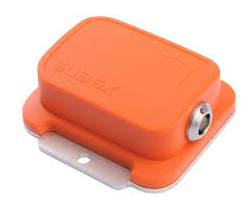

      Simulate the device in `Gazebo` and refer to the published topic. Display its contents in the terminal.

      9.2 **Kinect**.

      Kinect is popularly used in robotics to locate robots, detect obstacles and build models of the environment. The sensor returns an RGB image and a depth image.

      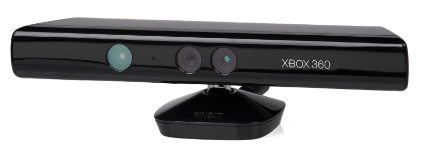

      Simulate the sensor in `Gazebo` and consult the list of themes. View their contents in the terminal and in `RViz`.

      Consider why the point cloud is rotated and the images do not overlap (in the `z` axis).

      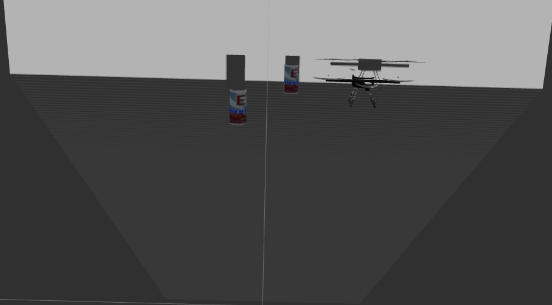

      9.3 **Hokuyo URG-04LX 2D laser scanner**.

      The URG-04LX-UG01 laser scanner has a measurement range from 20 mm to 5600 mm with an accuracy of 1 mm.

      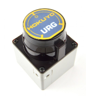

      Add any objects within the scanner range from the `Gazebo` interface or using the model loading menu.
      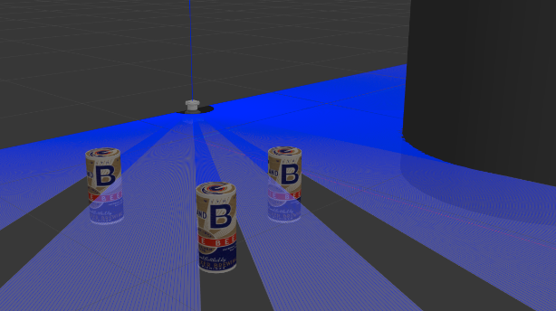

      Review the list of topics and display their contents in the terminal and in `RViz`.
      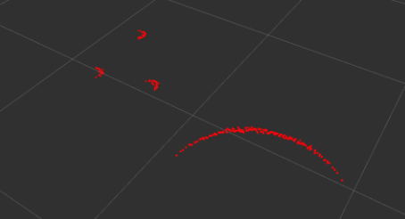

## Sources and useful references

🐢 [ROS 2 - developer guide](https://docs.ros.org/en/humble/The-ROS2-Project/Contributing/Developer-Guide.html)

🐢 [ROS 2 - documentation](https://docs.ros.org/en/humble/index.html)

🐢 [ROS 2 - design](http://design.ros2.org/)

🐢 [ROS2 - installation](https://docs.ros.org/en/humble/Installation/Ubuntu-Install-Debians.html) - Desktop Install
