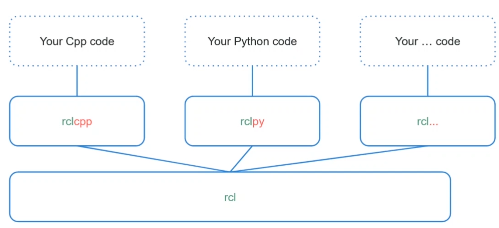
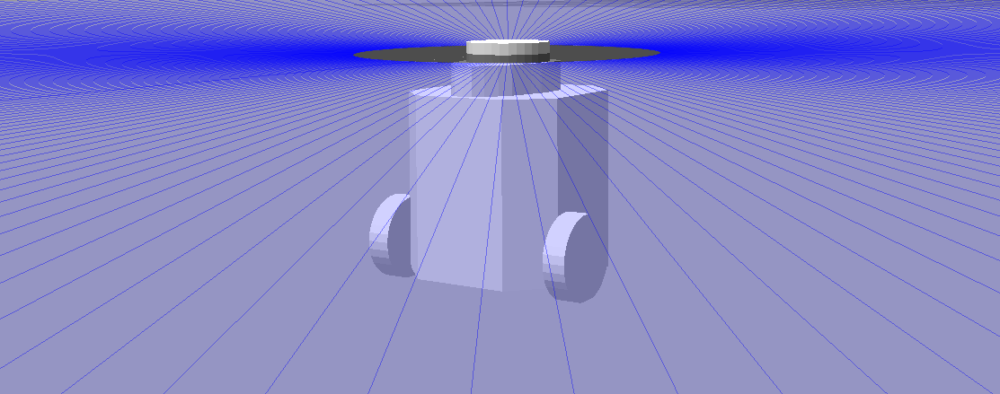

# Node creation and message processing


## Configuring the environment

Before you start working with ROS, call the command in each newly opened terminal:

- After the first compilation (there are `build`, `install`, `log` directories):

```bash
source install/setup.bash
```

- Before the first compilation:

```bash
source /opt/ros/humble/setup.bash
```

## Introduction

In this manual, we will create nodes that subscribe to and publish different types of messages. In addition, we will integrate the `OpenCV` library to work with ROS and use it to control a mobile robot.

## Creating nodes

### Create a package

Navigate to the `~/ros2_ws/src` directory. Create a package named `camera_subscriber` with dependencies `cv_bridge python3-opencv sensor_msgs geometry_msgs`. Specify `ament_python` as the `--build-type`.

```bash
ros2 pkg create camera_subscriber --build-type ament_python --dependencies cv_bridge python3-opencv sensor_msgs geometry_msgs
```

### Creating a node

Nodes can be created along with a package with the `ros2 pkg create` command, but here we will create a node manually. This method will also work if you want to add a node to an existing package.

1. Navigate to the `~/ros2_ws/src/camera_subscriber/camera_subscriber` directory.
2. Create a script with the `touch camera_node.py` command.
3. Paste the following code into the script:

    ```python
    #!/usr/bin/env python3

    import rclpy
    from rclpy.node import Node

    def main(args=None):
        rclpy.init(args=args)
        node = Node('camera_node')
        node.get_logger().info('Camera node started')
        rclpy.spin(node)
        rclpy.shutdown()

    if __name__ == '__main__':
        main()
    ```

4. In the `setup.py` file, make the following modification:

    ```python
        entry_points={
            'console_scripts': [
                'camera_node = camera_subscriber.camera_node:main',
            ],
        },
    ```

5. Build the environment with the `colcon build` command while in the main workspace directory.
6. Start the node with the command:

```bash
ros2 run camera_subscriber camera_node
```

In the above process, it is important to place the script correctly (points 1, 2) and add the executable file in `entry_points` (point 4). 

**It is also important to note that you need to build an environment to observe changes in the program's performance (point 5) - regardless of whether you are programming in Python or a compiled language (such as C++).**

The `rclpy` library (_ROS Client Library for the Python_) contains implementations of ROS-related concepts. Documentation is available [here](https://docs.ros2.org/latest/api/rclpy/index.html).

## Adding a subscriber

Open the file `camera_node.py` and paste the following content into it.

```python
#!/usr/bin/env python3

import rclpy # Python Client Library for ROS 2
from rclpy.node import Node # Handles the creation of nodes
from sensor_msgs.msg import Image # Image is the message type
from cv_bridge import CvBridge # ROS2 package to convert between ROS and OpenCV Images
import cv2 # Python OpenCV library


def listener_callback(image_data):
    # Convert ROS Image message to OpenCV image
    cv_image = CvBridge().imgmsg_to_cv2(image_data, "bgr8")
    # Display image
    cv2.imshow("camera", cv_image)
    # Stop to show the image
    cv2.waitKey(1)

def main(args=None):
    rclpy.init(args=args)
    # Create the node
    node = Node('camera_node')
    # Log information into the console
    node.get_logger().info('Hello node')
    # Create the subscriber. This subscriber will receive an Image
    # from the image_raw topic. The queue size is 10 messages.
    subscription = node.create_subscription(Image,'image_raw',listener_callback,10)
    # Spin the node so the callback function is called.
    rclpy.spin(node)
    # Spin the node so the callback function is called.
    rclpy.shutdown()

if __name__ == '__main__':
    main()
```

Note: If you do not have the required dependencies to run the project (`python3-opencv` or `ros-humble-cv-bridge`) use `rosdep`:

```bash
rosdep install --from-paths src -y --ignore-src --rosdistro humble
```

These dependencies were defined when the package was created.

The code shown creates a subscriber to the `/image_raw` topic, which can be obtained, for example, using the [`usb_cam`](https://github.com/ros-drivers/usb_cam/tree/ros2) package. **If you clone it, remember to switch the cloned repo to a release tag.** In the subscriber's callback, the `listener_callback` function, the conversion of the image from the ROS `Image` type to the type supported by the `OpenCV` library is performed and the camera frames are displayed. Documentation of the method to create subscribers (`create_subscription`) can be found [here](https://docs.ros2.org/foxy/api/rclpy/api/node.html#rclpy.node.Node.create_subscription).

## Object-oriented nodes and node publishing

[ROS2](https://docs.ros.org/en/humble/Tutorials/Beginner-Client-Libraries/Writing-A-Simple-Py-Publisher-And-Subscriber.html) documentation on node creation indicates the object-oriented method as the default for creating nodes. Creating scalable and modular code, often in an assembly, is the domain of object-oriented programming.
The following is a code template that can be used to create nodes object-oriented.

```python
#!/usr/bin/env python3
import rclpy
from rclpy.node import Node
 
class MyCustomNode(Node):
    def __init__(self):
        super().__init__("node_name")
 
def main(args=None):
    rclpy.init(args=args)
    node = MyCustomNode()
    rclpy.spin(node)
    rclpy.shutdown()
 
 
if __name__ == "__main__":
    main()
```

Extending the functionality of the node is done by adding functionality in the `MyCustomNode` class.

### Example of a publishing node

```python
#!/usr/bin/env python3
import rclpy
from rclpy.node import Node
from std_msgs.msg import String

class MinimalPublisher(Node):
    def __init__(self):
        super().__init__('minimal_publisher')
        self.publisher_ = self.create_publisher(String, 'topic_name', 10)
        timer_period = 0.5 # seconds
        self.timer = self.create_timer(timer_period, self.timer_callback)
        self.i = 0

    def timer_callback(self):
        msg = String()
        msg.data = 'Hello World: %d' % self.i
        self.publisher_.publish(msg)
        self.get_logger().info('Publishing: "%s"' % msg.data)
        self.i += 1

def main(args=None):
    rclpy.init(args=args)
    minimal_publisher = MinimalPublisher()
    rclpy.spin(minimal_publisher)
    rclpy.shutdown()

if __name__ == '__main__':
    main()
```

Starting with the definition of the class constructor, `super().__init__` internally calls the `Node` class constructor and gives a name to the node, in this case `minimal_publisher`. The `create_publisher` method creates an object that publishes messages of type `String` (imported from the `std_msgs.msg` library) on the `topic_name` subject. In addition, the value `10` given as an argument to this function means, as in the example with the subscriber, a buffer size equal to this value. In case the subscriber cannot keep up with processing messages, they will be discarded when the buffer size is exceeded.

A timer is then created with a callback that executes every 0.5 seconds. The variable `self.i` is an incremented counter.
The `timer_callback` function creates a message containing the state of the counter, displays it in the console using the `get_logger().info` method and publishes it on the topic.

Note that a node can simultaneously contain a publishing object and a subscribing object.

An example of a subscribing node can be found in [documentation](https://docs.ros.org/en/humble/Tutorials/Beginner-Client-Libraries/Writing-A-Simple-Py-Publisher-And-Subscriber.html).

## Nodes in different programming languages

[ROS2 Client Libraries](https://docs.ros.org/en/humble/Concepts/About-ROS-2-Client-Libraries.html) is an API that, allows users to implement ROS code. Using `Client Libraries`, code developers gain access to concepts such as nodes, topics, services, etc. The `Client Libraries` are available in a variety of programming languages, allowing users to write ROS code in the language that best suits their application. For example, you may want to write visualization tools in Python because it speeds up prototyping, while efficient nodes can be implemented in C++.

Sample template for creating an object node for C++ language:

```Cpp
#include "rclcpp/rclcpp.hpp"
 
class MyCustomNode : public rclcpp::Node
{
public:
    MyCustomNode() : Node("node_name")
    {
    }
 
private:
};
 
int main(int argc, char **argv)
{
    rclcpp::init(argc, argv);
    auto node = std::make_shared<MyCustomNode>();
    rclcpp::spin(node);
    rclcpp::shutdown();
    return 0;
}
```

Nodes written in different programming languages can still communicate because they are built on a common `rcl` (ROS2 Client Libraries) interface.



ROS functionalities for C++(`rclcpp`) and Python (`rclpy`) are managed and supported by ROS authors and teams. On the other hand, there are also other languages for which functionalities are created by the ROS community (e.g. Rust, Node.js, C, Android). More information [here](https://docs.ros.org/en/humble/Concepts/About-ROS-2-Client-Libraries.html#overview).

## Parameterization of object nodes

### Adding parameters to a node

The creation of parameters in the node is done using the `self.declare_parameter('my_parameter', 'my_value')` method, where `my_parameter` is the parameter name and `my_value` is the default value. The type of the parameter is inferred from the default value, so in this case it would be set to the `string` type.

Then, to read the current value of the parameter the `self.get_parameter_value()` method is used. The returned object is of type `rcl_interfaces.msg.ParameterValue`, so to get the value we refer to the `value` field.

Example code template:

```python
#!/usr/bin/env python3
import rclpy
from rclpy.node import Node

class MinimalParam(Node):
    def __init__(self):
        super().__init__('minimal_param_node')
        self.declare_parameter('param_name', 'default_value')
        self.my_param = self.get_parameter('param_name').value
        print(self.my_param)

def main():
    rclpy.init()
    node = MinimalParam()
    rclpy.spin(node)

if __name__ == '__main__':
    main()

```

All available types of parameters and methods of obtaining them are described in the following [link](https://docs.ros2.org/foxy/api/rclpy/api/parameters.html#parameters).

### Launching a node with parameters

Nodes can be started with parameters as follows:

```bash
ros2 run package_name node_name --ros-args -p param_name:=param_value
```

for example:

```bash
ros2 run demo_nodes_cpp parameter_blackboard --ros-args -p some_int:=42 -p "a_string:=Hello world" -p "some_lists.some_integers:=[1, 2, 3, 4]" -p "some_lists.some_doubles:=[3.14, 2.718]"
```

It is possible to load different types of parameters as well as sets (e.g. lists), and also whole files. More on this [here](https://docs.ros.org/en/humble/How-To-Guides/Node-arguments.html).

## Data exchanged between nodes - messages

A `message` (message) is a data structure exchanged between nodes. Files with the extension `*.msg` contain the message declaration. Custom messages are stored in a package directory named `msg`. Examples of available messages: [`std_msgs/String.msg`](https://docs.ros2.org/latest/api/std_msgs/msg/String.html), [`sensor_msgs/Image.msg`](https://docs.ros2.org/latest/api/sensor_msgs/msg/Image.html), [`trajectory_msgs/msg/JointTrajectory`](https://docs.ros2.org/latest/api/trajectory_msgs/msg/JointTrajectory.html).

Every time you intend to use a message you should define it in the dependencies in the `package.xml` file:

```xml
<depend>std_msgs</depend>.
<depend>sensor_msgs</depend>.
<depend>trajectory_msgs</depend>.
```

If you create your own message type, the process goes as follows:

1. In the root directory of the package, create a folder named `msg`.
2. In the `msg` folder, create a file with the extension `*.msg`, such as `MyMessage.msg`. Inside the file, define the structure according to the scheme:

```ros
fieldtype1 fieldname1
fieldtype2 fieldname2
fieldtype3 fieldname3
```

Ex.

```ros
int32 my_int
string[] my_string_array
```

or also with default values:

```ros
int32 my_int 60
string[] my_string_array ["a", "b", "c"]
```

All available variable types are listed [here](https://docs.ros.org/en/humble/Concepts/About-ROS-Interfaces.html#field-types).

3. In the `CMakeLists.txt` file, add the following lines for the `MyMessage.msg` message:

    ```CMake
    find_package(rosidl_default_generators REQUIRED)
    rosidl_generate_interfaces(${PROJECT_NAME}
    "msg/MyMessage.msg"
    )
    ```

4. In the `package.xml` file, add the following dependencies:

    ```xml
    <build_depend>rosidl_default_generators</build_depend>.
    <exec_depend>rosidl_default_runtime</exec_depend>.
    <member_of_group>rosidl_interface_packages</member_of_group>.
    ```

4 Build the environment with the `colcon build` command.

Note, the process shown assumes a package created with `ament_cmake`. In practice, you can create a separate package containing only message definitions for use in a second, Python, package. A compromise, allowing you to create Python nodes and messages at the same time, is to use `ament_cmake_python`. For more details, see the following [example](https://docs.ros.org/en/humble/Tutorials/Beginner-Client-Libraries/Single-Package-Define-And-Use-Interface.html) and [here](https://docs.ros.org/en/humble/How-To-Guides/Ament-CMake-Python-Documentation.html).

## Simulation of the mobile robot `TurtleBot`



### Installation
If the simulation is not yet installed on your computer, you can do so with the following command:

```bash
sudo apt install ros-humble-turtlebot3*
```

### Configuration

Select the robot model with the command:

```bash
export TURTLEBOT3_MODEL=burger
```

Point the path to the robot model with the command:

```bash
export GAZEBO_MODEL_PATH=$GAZEBO_MODEL_PATH:`ros2 pkg \
prefix turtlebot3_gazebo \
`/share/turtlebot3_gazebo/models/
```

### Startup

```bash.
ros2 launch turtlebot3_gazebo empty_world.launch.py
```

It is also possible to launch another simulated environment, such as `turtlebot3_house.launch.py`.

### Robot control

The robot is controlled by publishing a message on the `/cmd_vel` subject line.

You can do this with the command:

```bash
ros2 topic pub /cmd_vel geometry_msgs/msg/Twist "linear:
  x: 2.0
  y: 0.0
  z: 0.0
angular:
  x: 0.0
  y: 0.0
  z: 2.0"
```

There is also a dedicated node for controlling `TurtleBot` using the keyboard. However, it is necessary to set the robot's name first if you start a new terminal:

```bash
export TURTLEBOT3_MODEL=burger
```

Then run the node:

```bash
ros2 run turtlebot3_teleop teleop_keyboard
```

## Tasks

1. Perform the following test. Edit the sample code from the "Creating a node" subsection by commenting out the line containing `rclpy.spin(node)`. Observe the effect and consider what the purpose of this line of code is.

2. Based on the example from the "Adding a subscriber" subsection, write a subscriber to the camera image in the object version.

3. Run the following code (you can substitute `camera_node`). Using the code shown, make the message publish [`Point`](https://docs.ros2.org/latest/api/geometry_msgs/msg/Point.html), remember to import it. Publish on a topic named `/point`. The use of a timer is not necessary. For those who are willing, you can test in a version with a camera image.

    ```python
    #!/usr/bin/env python3
    import rclpy # Python Client Library for ROS 2
    from rclpy.node import Node # Handles the creation of nodes
    from sensor_msgs.msg import Image # Image is the message type
    from cv_bridge import CvBridge # ROS2 package to convert between ROS and OpenCV Images
    import cv2 # Python OpenCV library
    import numpy as np


    class MinimalSubscriber(Node):
        def __init__(self):
            super().__init__('minimal_subscriber')
            self.window_name = "camera"
            self.subscription = self.create_subscription(Image,'image_raw',self.listener_callback,10)
            self.subscription # prevent unused variable warning
            self.point = None

        def listener_callback(self, image_data):
            cv_image = np.zeros((512,700,3), np.uint8)
            if(self.point is not None):
                cv2.rectangle(cv_image,self.point,(self.point[0]+200,self.point[1]+200),(0,255,0),3)
            cv2.imshow(self.window_name,cv_image)
            cv2.waitKey(25)
            cv2.setMouseCallback(self.window_name, self.draw_rectangle)

        def draw_rectangle(self, event, x, y, flags, param):
            # if event == cv2.EVENT_LBUTTONDOWN: # check if mouse event is click
                self.point = (x,y)

    def main(args=None):
        rclpy.init(args=args)
        minimal_subscriber = MinimalSubscriber()
        rclpy.spin(minimal_subscriber)
        # Destroy the node explicitly
        # (optional - otherwise it will be done automatically
        # when the garbage collector destroys the node object)
        minimal_subscriber.destroy_node()
        rclpy.shutdown()

    if __name__ == '__main__':
        main()
    ```

4. To the code from the previous task, add a parameter specifying the length of the square (currently it is 200). Call the node with the changed value of this parameter.
5. Write a node that will periodically publish messages on the `/cmd_vel` topic for the `TurtleBot` robot. You can adopt the goal to make the robot go around in circles.
6. Make an extension of the program from the previous task. Use the published `/point` topic to make the robot drive forward (add linear velocity in the x-axis) when the clicked point is above the center of the screen, and stop in place when it is below. Take the one from task 3 (`512`) as the default window length.
