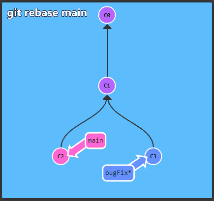
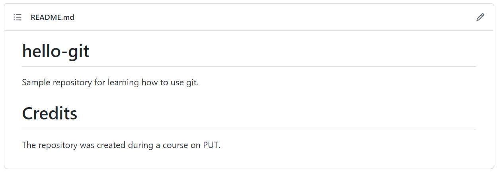

# Version control system - Git

## Introduction to version control

A version control system is used to track changes made to a file (or files) and allows you to revert to any previous state. It is a commonly used tool in software projects although embracing version control is possible for any type of file on a computer.

If you are interested in graphics or web design and want to maintain every version of a graphic file or web site layout (which seems like a reasonable idea), then using a version control system is the right tool for the job. It allows you to:
- restore a file (or files) to an earlier version, 
- restoring the state of the entire project, 
- comparing the changes made (even when one file was edited by many people), 
- obtaining information about who made a given modification and when.

The most widely distributed version control system is ```Git``` and the projects created within it are __repositories__. The popular site [```GitHub```](https://github.com/) provides network hosting for ```Git``` repositories.

***


### An interactive introduction to Git



To get started with ```Git``` take a look at the interactive tutorial available at [learngitbranching](https://learngitbranching.js.org/). It describes the most important concepts, which are presented in an intuitive, graphical form.

#### 🛠🔥 Task 1 🛠🔥.

Solve the first four tasks from the _Main: Introduction Sequence_ from [learngitbranching](https://learngitbranching.js.org/):
 1. Introduction to Git Commits
 2. Branching in Git
 3. Merging in Git
 4. Rebase Introduction
 
 and the following seven from _Push & Pull -- Git Remotes_:
 1. Clone Intro 
 2. Remote Branches
 3. Git Fetchin'
 4. Git Pullin'
 5. Faking Teamwork
 6. Git Pushin'
 7. Locked Main

***


## Hands-on Git exercises

#### 🛠🔥 Task 2 🛠🔥.

Create an account at [```GitHub```](https://github.com/). Try to use a reasonable username, as repositories are often a sort of portfolio for future employers. Decide to post the code you create to ```Git``` repositories today - over time, the use of version control will become a good habit and you will already have some history of "coding".

***

#### 🛠🔥 Task 3 🛠🔥

Create a new repository using [```GitHub```](https://github.com/) with a name such as _hello-git_. Fill in the description field (e.g. Example repository for learning how to use git), indicate your desire to create a ```README``` file and select [license](https://choosealicense.com/) for your project (e.g. _MIT_).

***

#### 🛠🔥 Task 4 🛠🔥.

Open a command terminal and configure the ```Git``` settings for your user:
```bash
git config --global user.name "Git user name"
git config --global user.email "Git user's email address".
```
Print the saved settings using the command:
```bash
git config -l
```

***

#### 🛠🔥 Task 5 🛠🔥.

Clone the created repository from ```github``` to your computer with the command ```git clone address```.
***

#### 🛠🔥 Task 6 🛠🔥.


Create any text file and upload it to your ```Git``` repository. Use the following commands in the following order:
<!--
1. [```git status``](https://git-scm.com/docs/git-status) - displays the current status of the repository you have downloaded to your computer.
2. [```git add``](https://git-scm.com/docs/git-add) with the argument ```-A``.
The ```git add`` command allows you to split the changes you have made into different commits, while the ```-A`` argument causes all the changes to be included at once. Note that the interactive introduction you solved omitted this command (it assumed committing all changes at once).
3. [```git commit``]() with the argument ```-m Brief description of changes made`` - adds the changes made to the repository history.
4. [```git push``]() - causes the remote repository to be updated.
-->

| Command | Function |
|--- |--- |
| ```git status``` (Optional) | Displays current status of the repository that was downloaded. |
| ```git add -A``` | The ```git add``` command allows you to split the changes made into different commits, while the ```-A``` argument causes all changes to be included at once. Note that the interactive introduction you solved omitted this command (it assumed committing all changes at once). 	|
| ```git commit -m "Brief description of changes made"``` | Adds the changes made to the repository history. |
| ```git push``` | Causes the remote repository to be updated with local changes. |

Watch the effect on ```Github```, take a look at the repository user interface.
***
#### 🛠🔥 Task 7 🛠🔥.

Code containing information about the author, dependencies in the project, installation and running instructions is simpler to use. Such information is usually placed in the ```README.md``` file. The language we use to create such files is ```Markdown```. 
Using [syntax information](https://docs.github.com/en/get-started/writing-on-github/getting-started-with-writing-and-formatting-on-github/basic-writing-and-formatting-syntax) try to edit the ```README.md``` file to achieve the result listed below. Use the browser-based editor at ```Github``` to do this.

***

#### 🛠🔥 Task 8 🛠🔥.

Call the ```cat``` command on the local ```README.md``` file to display its contents. Why doesn't the file contain the changes you made? Update the local version of the repository using the ```git pull``` command.
***

#### 🛠🔥 Task 9 🛠🔥

The projects you will be involved in in the future will most likely be team-based. Many repositories are also open-source, meaning you can influence the code in them. In this task, we will propose a change to the teachers's repository:
1. Open the indicated repository in a browser.
2. Go to the ```Issues``` tab and add them in the following format:
```
username:
GitHubUsername
```

The teacher will add you as a co-developer of the project.

3. Clone the repository to your computer. (```git clone address_www```).
4. Create your own branch in the repository by naming it with your username. (```git branch name_of_the_branch```). Note: You can execute command 4 and 5 with one command by adding an argument (```git checkout -b name_of_the_branch```).
5. Change the current branch to the newly created one (```git checkout name_of_the_branch```).
6. Create a new directory (name it with your username), and in this directory create a text file (name it with your initials ```.txt```) and paste the sample text into it (```United we stand, divided we fall!```).
6. Push the branch to the server. (```git push -u origin name_of_the_branch```). The ```-u``` argument causes changes to the newly created local branch to be tracked against changes to the remote repository.
7. Using the ```Github``` user interface, create a _pull request_ of the created branch to the master branch.

***

#### 🛠🔥 Homework 🛠🔥.

Find an answer to the question - what is the purpose of the ```.gitignore``` file?

## Sources and additional resources:

* [Free official e-book about Git](https://git-scm.com/book/en/v2).
